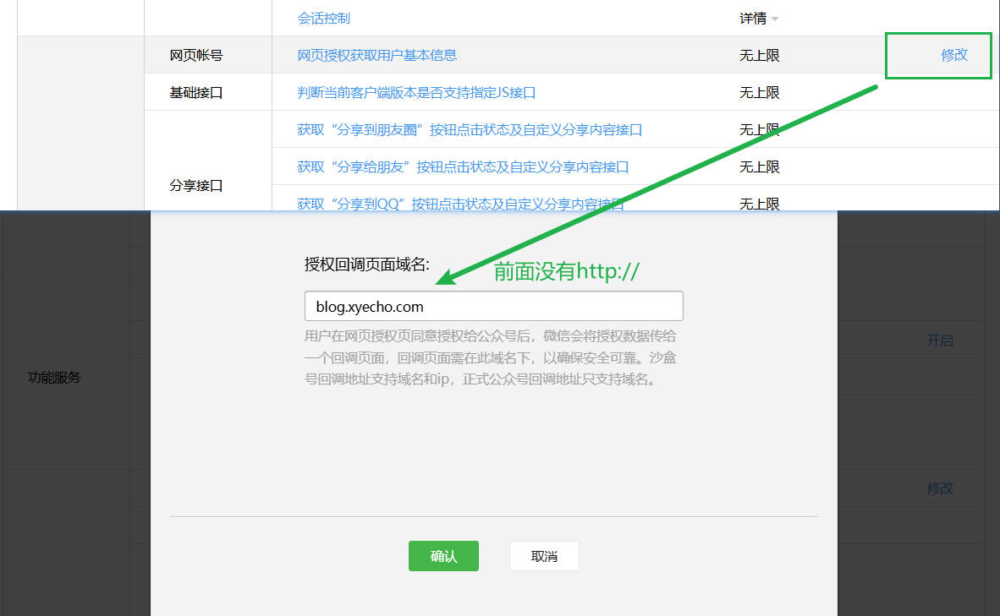

# 背景

微信平台的一些接口，统一到一个服务，方便 token的 管理。 


##  网页授权获取用户基本信息

微信平台接口文档：
https://developers.weixin.qq.com/doc/offiaccount/OA_Web_Apps/Wechat_webpage_authorization.html

在先配置回调域名： 



1、用户同意授权，获取code， 在微信客户端打开以下链接：

```sh
https://open.weixin.qq.com/connect/oauth2/authorize?appid=wx3cc8fd6963e31a32&redirect_uri=http%3A%2F%2Fblog.xyecho.com&response_type=code&scope=snsapi_userinfo &state=1024#wechat_redirect
```

跳转之后，可以在 url 中看到 code 参数，如下面的 `0611AjGa1GqOBI0xgMHa1ewUsg11AjG7` 传递给后端， 后端请求微信接口， 获取用户信息。

```sh
https://blog.xyecho.com/?code=0611AjGa1GqOBI0xgMHa1ewUsg11AjG7&state=

```

2、后端请求微信接口， 获取用户信息。

```sh 
curl --location --request POST 'http://127.0.0.1:36012/v1/service/wx/getwxuserinfo' \
--header 'User-Agent: Apifox/1.0.0 (https://apifox.com)' \
--header 'Content-Type: application/json' \
--header 'Accept: */*' \
--header 'Host: 127.0.0.1:36012' \
--header 'Connection: keep-alive' \
--data-raw '{"source" : "curl-test", "appid": "wx3cc8fd6963e31a32", "code": "031pdDGa1FvFCI0lWyIa1Y0nJC0pdDGt"}'
 

{
    "ret": {
        "code": 0,
        "msg": "OK",
        "request_id": "wxmsg_br9vbam8sy"
    },
    "body": {
        "appid": "",
        "access_token": "",
        "openid": "",
        "refresh_token": "",
        "nickname": "Hui🐠",
        "sex": 0,
        "province": "",
        "city": "",
        "country": "",
        "headimgurl": "https://thirdwx.qlogo.cn/mmopen/vi_32/PiajxSqBRaEIdIYeJicFqEyUiapmSOxxCUuia9wzP6yrQxBooAYBickbB1gw3Nw874iazo59jlrNFKubsZZUxc5JGLNClN7zuST7ZLicPgI1y5r9RpTOPHlBcibgRQ/132",
        "unionid": "",
        "is_snapshot_user": 0
    }
}

```


